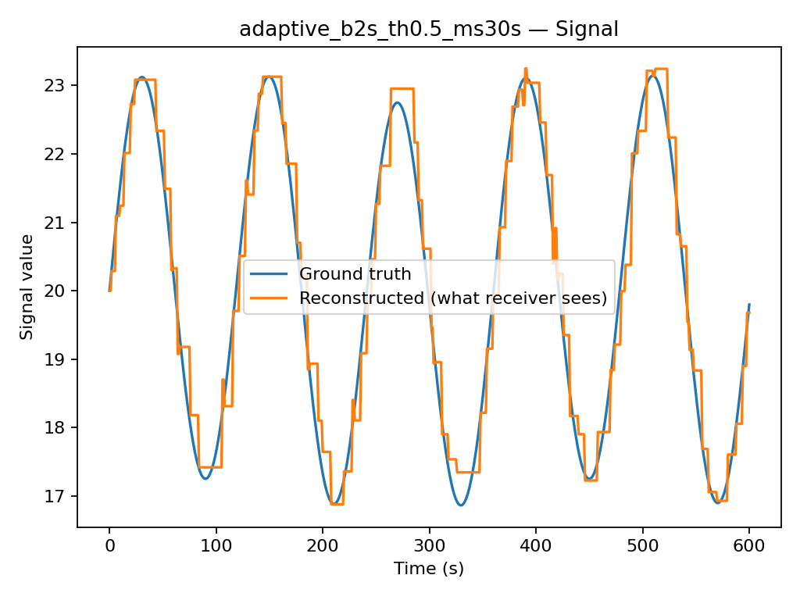
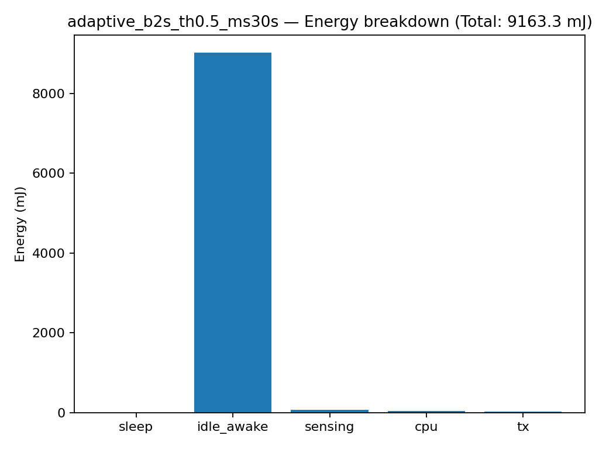

# Energy-Aware Sensor Node Simulator (Python)

This is a small, runnable project that simulates a **battery-powered IoT sensor node**.

The simulator models energy consumption for:
- **sleep**
- **awake/idle**
- **sensing**
- **CPU processing**
- **wireless transmission** (mocked, no real network)

It compares strategies (policies) and shows the trade-off between:
- **data quality** (how close the received/reconstructed signal is to the true signal)
- **energy usage** (how fast the battery would drain)

## Quick start

### 1) Run (works even without plotting)
```bash
python main.py --policy adaptive --out results
```

### 2) Try other policies
```bash
python main.py --policy fixed --out results_fixed
python main.py --policy duty --out results_duty
```

## Output

Each run saves:
- `report.json` (policy, config, energy totals/breakdown, quality metric)
- `plots/` (if matplotlib is installed)
  - `signal.png`
  - `energy_breakdown.png`

## Results (Example Output)

### Signal: Ground Truth vs Reconstructed


### Energy Breakdown



## Notes
- The energy units are **mJ** (millijoules) using **mW × seconds** accounting.
- Wireless link is mocked: we only model transmission time/energy, not real packet delivery.

## Optional: plotting dependency
If you want plots, install:
```bash
pip install matplotlib
```

## Customize settings
You can override defaults using a JSON config file:

```bash
python main.py --policy adaptive --config config_examples/default.json --out results_custom
```
